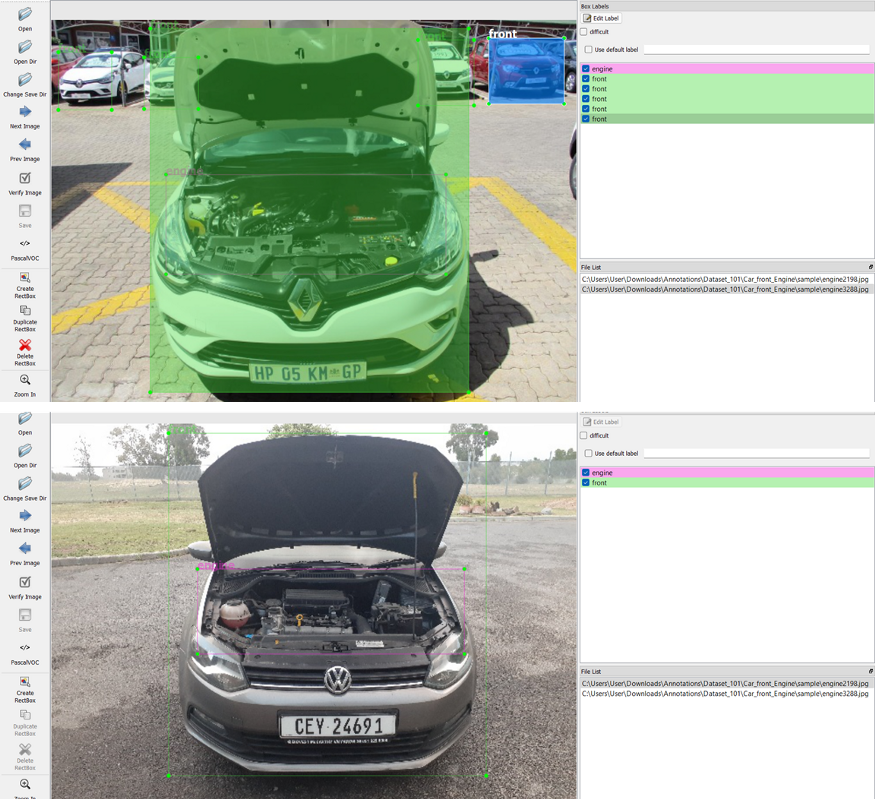
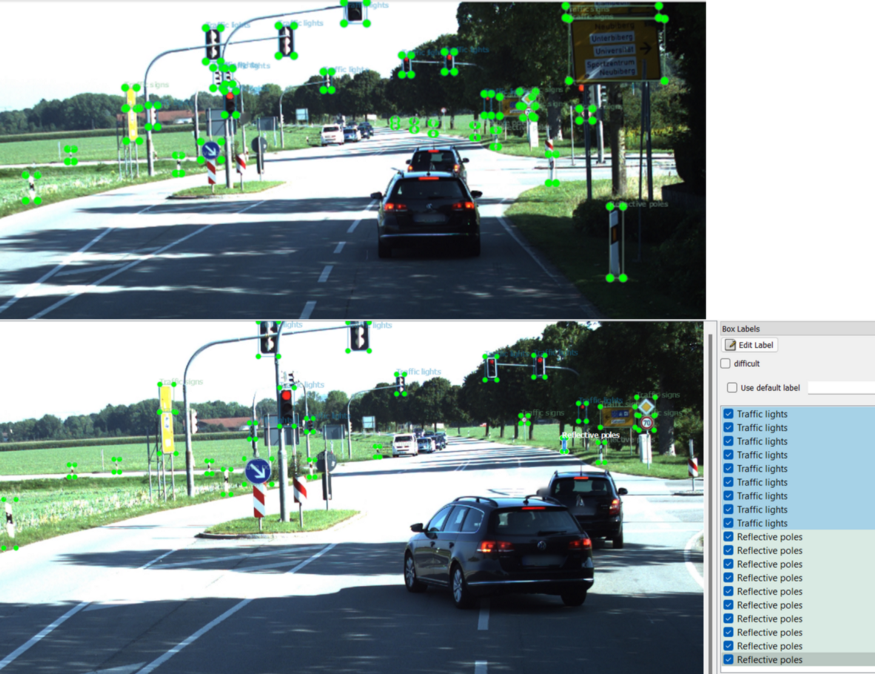

# Dataset 101- Machine/Deep Learning Dataset Collection

A data scientist with no data? No such thing! “Kaggle”
Instantly Download Clean & Ready-To-Use Datasets, These datasets are ideal for performing analyses, deriving insights and training machine/deep learning algorithms.

Dataset mostly consists of from these categories:
    
    Surveillance
    Security
    Automotive
    Road Safety
    Marine Life
    Wild Life
    Ecommerce
    Travel
    Job
    Healthcare
    Restaurant
    Classified
  
## 1. Guns and Pistol Annotations:
Dataset consists of around 12k+ guns/pistol marked Images taken from different cctv cameras recording. Dataset available in csv, coco and pascal voc format.

## 2. Retail Store Products Barcode dataset:
The dataset includes 15,000 images of products with barcodes that cover a variety of orientation and light perspectives.

## 3. Men body parts (right/left leg, arm, torso and head) annotation:
In 206 images, men’s body parts such as the right/left leg, arm, torso, and head are annotated in various poses and styles. Annotations available in coco, json format.

## 4. Vehicle/Car Engine and instrument cluster/meter annotations:
In 9500 images, Vehicle/Car Engine and instrument cluster/meter are annotated in covering different automakers cars and designs. Annotations available in Pascal VOC, CSV format.

## 5. Road cracks regions annotations:
In 80 images, road cracks are annotated in various sizes and conditions. Annotations available in coco, json format.

## 6. Satellite Imaginary Commercials Airplanes annotations:
In 700 images, obtain from google earth pro, commercial air planes are marked. Annotations available in Pascal VOC, Yolo format.

## 7. Underwater Fish annotations:
13400 images were obtained from the underwater sea area, covering coral reefs and aquatic plants area fish. Some information about fish species has also been marked.

## 8. Industrial Forklift and person annotations:
Inside factory, forklift, forklift cabin, transpallet, person head and torso are marked in 2200 images, covering a wide range of individual and groups of forklifts types.

## 9. Forms Images Annotations of checkbox, textbox, Radio button and Tables:
Forms images annotations of checkbox, textbox, radio button and tables consists of around 4,000 annotations on 200 images.

## 10. Flying Drone annotated images:
Around 3300 images have been annotated in various drone flying scenarios, both inside and outside the building. Drone: Dji mavic pro 2

## 11. Toilet paper annotations:
Around 1700 annotated images available in various toilet paper position both individually and in the groups (industrial production).

## 12. Trading bar’s candlestick chart annotations:
Around 400 annotated photos of various trading bar candlestick types are available, with representations of bar locations on the images.

## 13. Traffic Cone’s annotations:
The images of the Traffic Cone are labelled as either staying or lying down on the ground. A total of 700 annotated images with thousands of cone annotations are available.

## 17. Wheat seeds on plant annotations:
To estimate crop production, images of wheat seed/grains are marked on green wheat plants. There are 200 annotated images available, each having thousands of seeds annotations.

## 15. Vehicles/Cars and Number plates annotations:
Vehicles/cars images are annotations available covering some features like Car colour, model, make and Number plate on some images. A total of 27000 images are available, with many more labels in total.

## 16. Traffic Lights Signs Reflective pools Crash barrier
25,000 annotations of street images obtained from Google Street View (Germany). The annotated images include traffic lights, traffic signs, street signs, reflective pools, and crash barriers annotations.

## 17. Sea Port objects annotations (Person, Truck, Tug Master and Reach Stacker)
6200 images consists of thousands of annotations of Sea Port objects like Person, Truck, Tug Master and Reach Stacker etc.

## 18. Human face features Annotations:
500 human faces and hair are annotated based on following features:
Forehead — up Oval Round Long Square Forehead — Ey Close Set Wide set Nose Hooked Droopy Aquiline Roman Grecian Button Upturned Snub Funnel Eyebrows Curved Angled Soft Angled Rounded Flat Hair Style Bald Shaved Spiky Pixie cut Bob Pinned back Basin Pony Tail Medium length Short womens Long Hair Bun Dreadlocks Afro Mohawk Plaits Hair Type Straight Wavy Curly Coily Dreadlocks Shaved Facial Hair clean shaven neat beard scruffy beard handlebar mustache pencil mustache stubble soul patch goatee goatee and sideburns Jaw square round wide narrow trianagle oval fat thin diamond Ear square pointed narrow sticking out round attached broad Cheek short dimplees long dimples freckles no dimples Lips natural full small thin thin upper thin lower Eyes upturned round monolid downturned hooded almond Face Shape oval square round diamond heart.

All these dataset have been done by team members for research and commercial use cases. These dataset have some minor cost attach that would help the team for their future research. To get any of these dataset please email at mrahmadafaq@gmail.com

